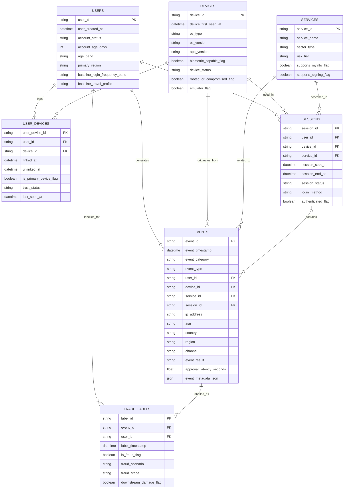

# Backend Table Design

Last updated: 11 April 2026

## Purpose

This document defines the minimum viable backend table design for the shared Singpass anti-fraud dataset.

It combines three things in one place:

- the logical backend structure
- the entity relationship diagram
- guidance on what values are expected in each column

The goal is to keep the prerequisite layer compact while making the shared data model easy to review before implementation starts.

## Design objective

The backend design should support:

- one shared synthetic environment for both projects
- user, device, service, and session linkage
- one central event log across all Singpass-like event families
- separate fraud labelling for evaluation

The design is intentionally minimal. It is not meant to replicate the full internal structure of a production database, but it should still feel realistic enough for anti-fraud analysis.

## High-level structure

The backend has three logical layers:

- reference entities
- activity data
- fraud evaluation labels

The reference layer describes who and what exists in the environment.

The activity layer describes what happened over time.

The label layer stores the synthetic fraud truth used for training and evaluation.

## Table overview

The minimum viable backend includes seven tables:

1. users
2. devices
3. user_devices
4. services
5. sessions
6. events
7. fraud_labels

## Entity relationship diagram

## How to read the backend model

### 1. Reference entities

The reference layer contains:

- `users`
- `devices`
- `user_devices`
- `services`

These are longer-lived records that provide context.

### 2. Activity layer

The activity layer contains:

- `sessions`
- `events`

This is the main analytical layer for both projects.

### 3. Label layer

The label layer contains:

- `fraud_labels`

This keeps fraud truth separate from raw activity records.

## Table-by-table design

### 1. users

Grain:

- one row per user account

Primary key:

- `user_id`

Key relationships:

- one user can link to many rows in `user_devices`
- one user can have many `sessions`
- one user can generate many `events`
- one user can have many `fraud_labels`

Role in the system:

- acts as the account-level anchor for all downstream fraud analysis

Column guidance:

| Column | Meaning | Example / Expected values |
| --- | --- | --- |
| `user_id` | synthetic unique account identifier | values like `U000001`, `U034281`; likely thousands to tens of thousands of unique users |
| `user_created_at` | account creation timestamp | datetime such as `2024-09-18 10:24:00` |
| `account_status` | current account state | limited set such as `active`, `locked`, `suspended`, `inactive` |
| `account_age_days` | days since account creation | integer such as `12`, `230`, `1450` |
| `age_band` | synthetic user age grouping | values like `18_24`, `25_34`, `35_49`, `50_64`, `65_plus` |
| `primary_region` | user’s usual location region | values like `SG_CENTRAL`, `SG_EAST`, `SG_WEST`, `SG_NORTH`, `SG_NORTHEAST` |
| `baseline_login_frequency_band` | typical login frequency | values like `low`, `medium`, `high` |
| `baseline_travel_profile` | typical mobility or travel pattern | values like `local_only`, `occasional_travel`, `frequent_travel` |

### 2. devices

Grain:

- one row per device

Primary key:

- `device_id`

Key relationships:

- one device can link to many rows in `user_devices`
- one device can appear in many `sessions`
- one device can generate many `events`

Role in the system:

- provides device-level context for login risk, trust state, and behavioural monitoring

Column guidance:

| Column | Meaning | Example / Expected values |
| --- | --- | --- |
| `device_id` | synthetic unique device identifier | values like `D000001`, `D098221` |
| `device_first_seen_at` | first time the device appears in the environment | datetime |
| `os_type` | mobile operating system | limited set such as `ios`, `android` |
| `os_version` | operating system version | values like `17.4`, `16.7`, `14`, `15` |
| `app_version` | Singpass app version proxy | values like `12.1.0`, `12.3.2`, `13.0.1` |
| `biometric_capable_flag` | whether the device can support biometric login | `true` or `false` |
| `device_status` | general trust or operating state | limited set such as `active`, `inactive`, `replaced`, `flagged` |
| `rooted_or_compromised_flag` | synthetic indicator for suspicious device integrity | `true` or `false` |
| `emulator_flag` | whether the device is simulated as emulator-like | `true` or `false` |

### 3. user_devices

Grain:

- one row per user-device relationship over time

Primary key:

- `user_device_id`

Foreign keys:

- `user_id -> users.user_id`
- `device_id -> devices.device_id`

Role in the system:

- records the relationship between a user and a device
- allows the same device to be linked to different users over time if needed
- supports trusted-device analysis without overloading either the `users` or `devices` table

Column guidance:

| Column | Meaning | Example / Expected values |
| --- | --- | --- |
| `user_device_id` | synthetic unique relationship identifier | values like `UD000001` |
| `user_id` | related user | one of the IDs from `users` |
| `device_id` | related device | one of the IDs from `devices` |
| `linked_at` | when the device was linked to the user | datetime |
| `unlinked_at` | when the link ended, if applicable | datetime or null |
| `is_primary_device_flag` | whether this is the main device for the user | `true` or `false` |
| `trust_status` | current trust relationship | limited set such as `trusted`, `new`, `revoked`, `stale` |
| `last_seen_at` | most recent activity timestamp for this user-device pair | datetime |

### 4. services

Grain:

- one row per service

Primary key:

- `service_id`

Key relationships:

- one service can appear in many `sessions`
- one service can appear in many `events`

Role in the system:

- provides service-level context such as sector and risk tier

Column guidance:

| Column | Meaning | Example / Expected values |
| --- | --- | --- |
| `service_id` | synthetic unique service identifier | values like `S0001`, `S0017` |
| `service_name` | synthetic or proxy service name | values like `bank_onboarding_portal`, `insurance_policy_portal`, `gov_benefits_service` |
| `sector_type` | service sector | limited set such as `government`, `banking`, `insurance`, `telecom`, `other_private` |
| `risk_tier` | relative service risk | limited set such as `low`, `medium`, `high` |
| `supports_myinfo_flag` | whether service supports Myinfo-like data sharing | `true` or `false` |
| `supports_signing_flag` | whether service supports Sign-like flows | `true` or `false` |

### 5. sessions

Grain:

- one row per login or authenticated session

Primary key:

- `session_id`

Foreign keys:

- `user_id -> users.user_id`
- `device_id -> devices.device_id`
- `service_id -> services.service_id`

Role in the system:

- groups related events into a usable analytical unit
- supports both login-risk analysis and post-authentication monitoring

Design note:

- not every event must belong to a session
- some account or device lifecycle events may exist outside a fully authenticated session

Column guidance:

| Column | Meaning | Example / Expected values |
| --- | --- | --- |
| `session_id` | synthetic unique session identifier | values like `SE000001` |
| `user_id` | related user | one of the IDs from `users` |
| `device_id` | device used in the session | one of the IDs from `devices` |
| `service_id` | service accessed in the session | one of the IDs from `services` |
| `session_start_at` | start timestamp | datetime |
| `session_end_at` | end timestamp | datetime |
| `session_status` | overall session state | limited set such as `completed`, `abandoned`, `failed`, `restricted` |
| `login_method` | method used for login | limited set such as `qr_login`, `app_login`, `face_verification` |
| `authenticated_flag` | whether access was successfully established | `true` or `false` |

### 6. events

Grain:

- one row per event

Primary key:

- `event_id`

Foreign keys:

- `user_id -> users.user_id`
- `device_id -> devices.device_id`
- `service_id -> services.service_id`
- `session_id -> sessions.session_id`, nullable

Role in the system:

- acts as the central event log across all Singpass-like event categories
- stores the event stream used by both projects

Design note:

- this is the most important table in the backend design
- login, consent, signing, recovery, and device lifecycle activity should all land here

Column guidance:

| Column | Meaning | Example / Expected values |
| --- | --- | --- |
| `event_id` | synthetic unique event identifier | values like `E00000001` |
| `event_timestamp` | when the event happened | datetime |
| `event_category` | high-level event family | limited set such as `login_authentication`, `service_usage`, `account_device_lifecycle`, `consent_data_sharing`, `digital_signing_authorisation`, `recovery` |
| `event_type` | specific event inside the category | values like `qr_login_request`, `qr_login_approved`, `app_login_success`, `service_access_view`, `dashboard_view`, `device_changed`, `consent_granted`, `sign_approved` |
| `user_id` | related user | one of the IDs from `users` |
| `device_id` | related device | one of the IDs from `devices`, nullable for some events if needed |
| `service_id` | related service | one of the IDs from `services`, nullable for some lifecycle events |
| `session_id` | related session | one of the IDs from `sessions`, nullable if outside session |
| `ip_address` | synthetic IP or IP-like value | values like `103.12.44.2`, `198.51.100.17` |
| `asn` | synthetic autonomous system or network identifier | values like `AS13335`, `AS4788`, `AS00LOCAL` |
| `country` | country code or label | values like `SG`, `MY`, `ID`, `TH`, `UNKNOWN` |
| `region` | finer-grained region | values like `SG_CENTRAL`, `SG_EAST`, `KUALA_LUMPUR`, `JAKARTA` |
| `channel` | event interaction channel | limited set such as `mobile_app`, `desktop_web`, `mobile_web`, `api` |
| `event_result` | outcome of the event | limited set such as `success`, `failure`, `rejected`, `cancelled`, `timeout`, `completed` |
| `approval_latency_seconds` | time taken to approve, when relevant | numeric values like `1.2`, `4.7`, `18.5`, null when not applicable |
| `event_metadata_json` | flexible event-specific detail | JSON blob containing extra fields such as prompt count, sequence hints, unusual context flags, or scenario-specific attributes |

### 7. fraud_labels

Grain:

- one row per labelled fraud outcome

Primary key:

- `label_id`

Foreign keys:

- `event_id -> events.event_id`
- `user_id -> users.user_id`

Role in the system:

- stores synthetic ground-truth fraud outcomes for evaluation
- keeps labels separate from the raw event stream

Design note:

- labels are intentionally separated because fraud truth is often delayed in real systems

Column guidance:

| Column | Meaning | Example / Expected values |
| --- | --- | --- |
| `label_id` | synthetic unique label identifier | values like `L000001` |
| `event_id` | related event being labelled | one of the IDs from `events` |
| `user_id` | related user | one of the IDs from `users` |
| `label_timestamp` | when the label is assigned in the synthetic environment | datetime |
| `is_fraud_flag` | binary fraud label | `true` or `false` |
| `fraud_scenario` | scenario that produced the label | values like `normal_returning_login`, `malicious_approval`, `relinquished_account_operation`, `suspicious_downstream_misuse` |
| `fraud_stage` | stage where fraud is observed | limited set such as `login_stage`, `post_login_stage` |
| `downstream_damage_flag` | whether downstream harm occurred or is simulated to occur | `true` or `false` |

## Relationship summary

The core relationships are:

- `users` to `user_devices`: one-to-many
- `devices` to `user_devices`: one-to-many
- `users` to `sessions`: one-to-many
- `devices` to `sessions`: one-to-many
- `services` to `sessions`: one-to-many
- `users` to `events`: one-to-many
- `devices` to `events`: one-to-many
- `services` to `events`: one-to-many
- `sessions` to `events`: one-to-many, optional on the event side
- `events` to `fraud_labels`: one-to-many or one-to-one depending on implementation choice

## Analytical interpretation

### Project 1

Project 1 mainly uses:

- `events`
- `sessions`
- `user_devices`
- `devices`
- `users`
- `fraud_labels`

Its core focus is the login-stage event.

### Project 2

Project 2 mainly uses:

- `sessions`
- `events`
- `services`
- `user_devices`
- `devices`
- `users`
- `fraud_labels`

Its core focus is the post-login session and event sequence.

## Suggested storage roles

To mimic a realistic backend setup, the tables can be grouped conceptually into:

### Source-like reference tables

- users
- devices
- user_devices
- services

These change more slowly and provide context.

### Source-like activity tables

- sessions
- events

These are the main behavioural records.

### Analytical truth table

- fraud_labels

This is the evaluation layer rather than the operational event layer.

## Practical design notes

### Why `user_devices` is separate

This table exists because the relationship between a user and a device is itself important.

It allows the synthetic environment to represent:

- trusted devices
- newly linked devices
- devices shared across users over time

### Why `events` contains network fields directly

The version 1 schema keeps:

- `ip_address`
- `asn`
- `country`
- `region`

inside `events` rather than normalising them into a separate network table.

This keeps the minimum viable schema simpler while still supporting login-risk and monitoring features.

### Why `fraud_labels` is separate

This separation makes the design more realistic:

- events happen first
- labels are attached later

That is closer to how fraud truth usually appears in real systems.

## Why this backend design is enough

This minimum design is sufficient because:

- project 1 mainly needs user, device, service, session, and login-related event context
- project 2 mainly needs session-level and event-level sequence analysis after authentication
- both projects can share the same event stream and labels

This avoids premature complexity while still preserving a backend structure that looks credible to a hiring manager.

## What is deferred to later versions

The following structures are intentionally deferred:

- separate network table
- separate journey table
- event-type-specific extension tables
- rule-decision tables
- investigation or case-management tables

These can be added later if the portfolio expands, but they are not necessary for the minimum viable design.

## Recommended implementation order

1. Build the reference tables: `users`, `devices`, `user_devices`, `services`
2. Build the activity tables: `sessions`, `events`
3. Generate synthetic event sequences across the defined taxonomy
4. Attach synthetic evaluation outcomes in `fraud_labels`
5. Derive project-specific views from the shared backend

## Conclusion

This backend table design provides a practical foundation for the portfolio.

It is intentionally small, but it preserves the essential structure needed to simulate a Singpass-like fraud environment and to support both the login-risk and post-compromise monitoring projects from one shared data backbone.
